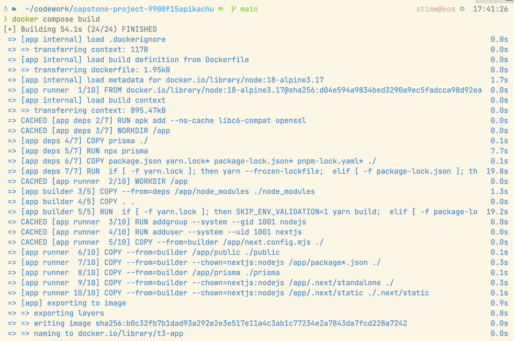
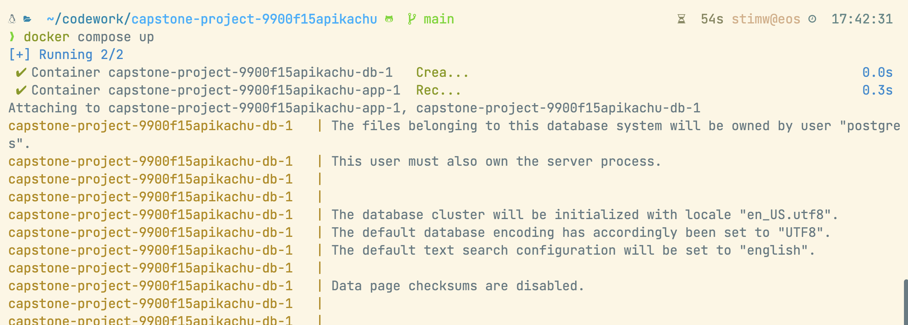
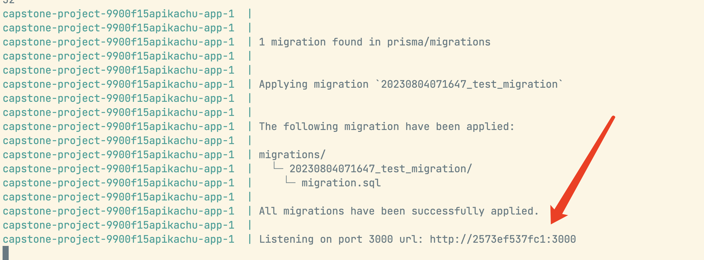

# Project Disclaimer and Acknowledgment

## Disclaimer

This GitHub repository contains materials developed for educational and demonstration purposes. 

Please be aware that any unauthorized use of these materials, including but not limited to copying, reproducing, or presenting them as one's own work, is strictly prohibited and may constitute academic dishonesty or plagiarism.

As an individual contributor to this project, I have invested time and effort into creating original and innovative work. I expect that others will respect this effort by not engaging in any form of academic dishonesty.


## Usage Guidelines

Educational and Demo Purposes: This repository serves as a demonstration of the project's capabilities and the contributions made by myself, Chloe Chen, and others. You may refer to the materials provided here for learning and understanding concepts related to health check chatbot. However, any direct use of these materials in academic or commercial contexts without proper acknowledgment is prohibited.

Attribution: If you find the content of this repository helpful and wish to reference it in your own projects or research, please provide proper attribution by acknowledging the contributions made by myself, Chloe Chen, and any other contributors mentioned in the project documentation.

No Commercial Use: The materials in this repository are not licensed for commercial use. You may not use them for any commercial purposes without explicit permission from the project contributors.

## Conclusion 

Thank you for taking the time to review this disclaimer. By accessing and using the materials in this repository, you agree to abide by the guidelines outlined above. If you have any questions or concerns regarding the use of these materials, please feel free to contact me directly.


# Pikachu

This is a [T3 Stack](https://create.t3.gg/) project bootstrapped with `create-t3-app`.

- [Next.js](https://nextjs.org)
- [NextAuth.js](https://next-auth.js.org)
- [Prisma](https://prisma.io)
- [Tailwind CSS](https://tailwindcss.com)
- [tRPC](https://trpc.io)

## How to run the project

```
docker compose build
docker compose up
```

Then it will show that it's listening to the port 3000.

Then we can open http://localhost:3000/ on the browser.







## How to begin with the project

1. run `npm install`

2. Please make a copy of `.env.example` and rename it as `.env`.

   Then make sure all the fields are filled, such as database url (please read the guidelines below for database installation)

3. run `npm run dev` to begin

### Database Install

For mac, refer to https://wiki.postgresql.org/wiki/Homebrew

### Git

#### 1.1 Git commit message standard

You should follow the [Conventional Commits](https://www.conventionalcommits.org/en/v1.0.0/).

If you're using VS Code, there's a [good extension](https://marketplace.visualstudio.com/items?itemName=vivaxy.vscode-conventional-commits).

Common scenes:

```
chore: update diary
feat: add login page
fix: fix login router
docs: update README.md
build: modify Dockerfile
...
```

#### 1.2 How to contribute

1. Create a new branch from `main` branch:

   ```bash
   git switch -c feature/add-new-component
   ```

   for a new feature such as login page, then `feature/add-login-page`

   for a bug fix, then `fix/fix-a-bug`,

   for update your diary, then `chore/update-diary`

2. When you're ready to push the branch, you can first `pull` and `rebase` all the updates from the `main` branch:

   ```bash
   git switch main
   git pull origin main
   git switch feature/add-new-component
   git rebase main
   ```

3. If there's any conflict, resolve it.

4. Now push your new branch and create a pull request.

5. Request a review and wait for the maintainer to review and merge the pull request.

#### 1.3 Git GUI recommendation

https://git-fork.com/

no need to pay

## Learn More

To learn more about the [T3 Stack](https://create.t3.gg/), take a look at the following resources:

- [Documentation](https://create.t3.gg/)
- [Learn the T3 Stack](https://create.t3.gg/en/faq#what-learning-resources-are-currently-available) — Check out these awesome tutorials

You can check out the [create-t3-app GitHub repository](https://github.com/t3-oss/create-t3-app) — your feedback and contributions are welcome!
